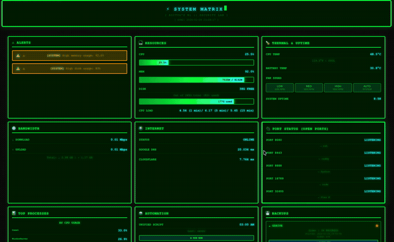
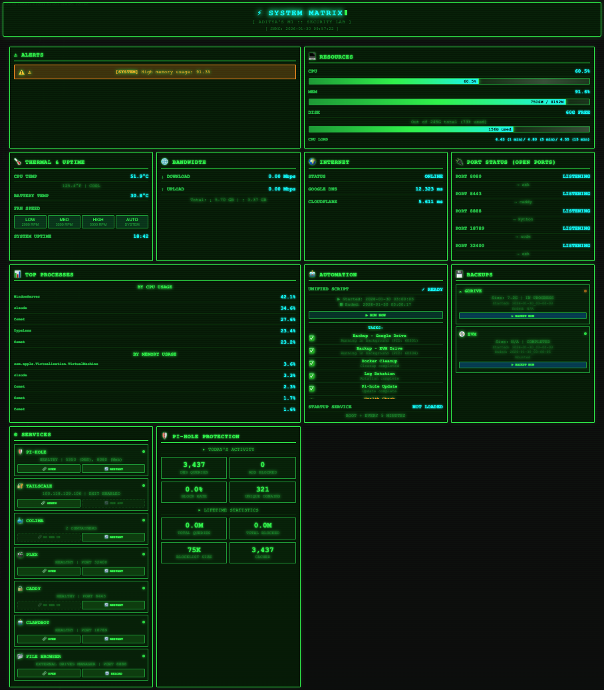
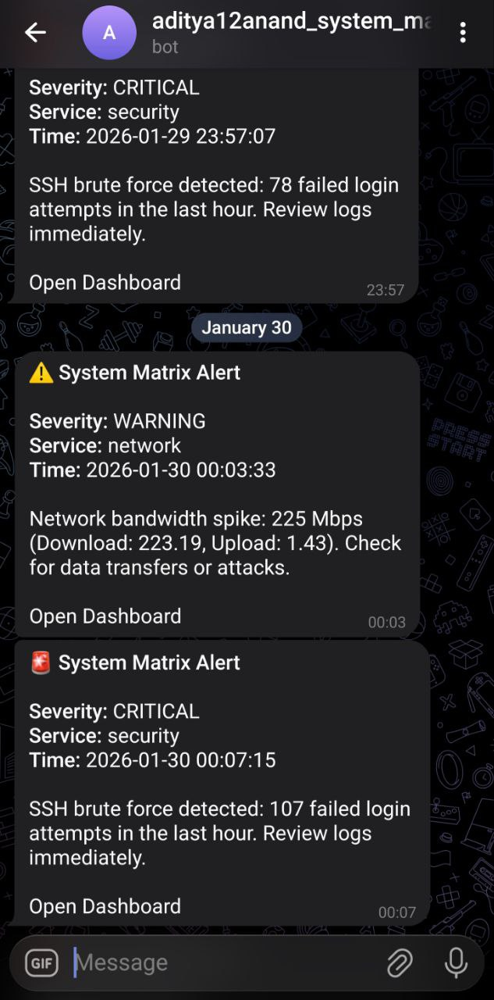
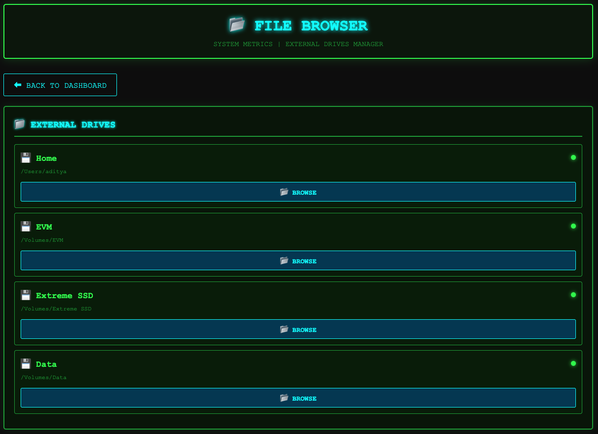

# System Matrix 🖥️

> **A powerful, yet friendly macOS monitoring dashboard that keeps your system healthy, secure, and running smoothly.**

Hey there! 👋 Welcome to System Matrix - your Mac's new best friend. Think of it as a control center that watches over your system 24/7, sends you alerts when something needs attention, and even handles routine maintenance while you sleep.

[](https://www.apple.com/macos/)
[](LICENSE)
[](https://github.com/anand1996aditya/system-matrix)

---

## 🎥 See It In Action

<div align="center">
  
  <p><i>System Matrix in action - real-time monitoring, alerts, and automation</i></p>
</div>

### 📸 Screenshots

<table>
  <tr>
    <td width="50%">
      
      <p align="center"><i>Real-time monitoring dashboard with Matrix theme</i></p>
    </td>
    <td width="50%">
      
      <p align="center"><i>Smart notifications delivered to your phone</i></p>
    </td>
  </tr>
  <tr>
    <td width="50%">
      
      <p align="center"><i>Built-in file browser for managing files across all drives</i></p>
    </td>
    <td width="50%">
    </td>
  </tr>
</table>

---

## 🎯 What is System Matrix?

You know that feeling when your Mac starts acting up, but you're not sure why? Or when you forget to run backups for weeks? System Matrix solves these problems.

It's a **monitoring and automation dashboard** that:
- 📊 Shows you **real-time metrics** (CPU, memory, disk, network) in a sleek web interface
- 🚨 Sends **Telegram alerts** when something goes wrong (disk full, service crashed, security threat)
- 🤖 **Automates maintenance** tasks (backups, cleanup, updates) on a schedule
- 🔍 **Detects issues** before they become problems (high memory, failing drives, suspicious activity)
- 🎨 Looks **gorgeous** with a Matrix-themed UI (because why not?)

**Best part?** Once you set it up, it just works. No babysitting required.

---

## ✨ Features That'll Make You Smile

### 📊 Real-Time Dashboard

Open your browser to `http://localhost:8888` and see:

- **System Health**: CPU usage, memory pressure, disk space, network activity
- **Service Status**: Docker containers (Pi-hole, Plex, etc.), Tailscale VPN, and more
- **Internet Quality**: Latency to Google, Cloudflare, your router
- **Temperature**: Keep an eye on that M1/M2 chip temperature
- **Top Processes**: See what's eating your RAM and CPU

All auto-refreshing every 10 seconds, with gradient progress bars that look *chef's kiss*.

### 🔔 Smart Alerts (via Telegram)

Get instant notifications for:

**Security Issues:**
- SSH brute force attempts (someone's trying to break in!)
- Unexpected open ports (did something start listening?)
- Failed login attempts (sus activity detected)

**System Health:**
- Memory running low (90%+ usage)
- Disk space critical (75%+ full)
- CPU overheating (85°C+)

**Service Problems:**
- Docker containers crashed
- Pi-hole stopped blocking ads
- Tailscale VPN disconnected
- Critical services down

**Backup & Maintenance:**
- Backup failed to run
- Backup size anomaly (way too big or small)
- External drives missing

And it's **smart about notifications** - won't spam you with the same alert every minute. Configurable cooldown periods keep your sanity intact.

### 🤖 Automation That Actually Works

Set it and forget it. Every night at 3 AM (or whenever you choose):

✅ **Backs up your files** to Google Drive and external drives
✅ **Cleans Docker** (removes unused containers, images, volumes)
✅ **Rotates logs** (keeps things tidy)
✅ **Updates Pi-hole** (fresh blocklists)
✅ **Checks system health** (and auto-fixes what it can)
✅ **Monitors performance** (catches slowdowns early)

All logged, all tracked, all automatic.

### 🎨 Beautiful Interface

Forget boring terminal outputs. System Matrix gives you:

- **Matrix-themed UI** with green gradients and that hacker aesthetic
- **File Browser** - manage files across all your drives (including external)
- **Responsive design** - works on your Mac, iPad, even your phone
- **Password protected** - secure by default
- **Dark mode** - because your eyes deserve better

### 🔐 Security by Design

- **Auto-detects services** - only shows what you have installed (no hardcoded assumptions)
- **Git hooks** - blocks accidental commits of secrets/credentials
- **Config separation** - all sensitive data in git-ignored config files
- **Rate limiting** - brute force protection on the dashboard
- **Comprehensive scanner** - validates no secrets before every commit

---

## 🚀 Quick Start (Seriously, It's Easy)

### What You Need

- **macOS** (tested on Monterey and newer)
- **Python 3.7+** (already on your Mac)
- **5 minutes** (for real)

**Optional but cool:**
- Docker (for Pi-hole, Plex, etc.)
- Telegram account (for alerts)
- External drives (for backups)

### Installation

**1. Clone this repo:**
```bash
git clone https://github.com/anand1996aditya/system-matrix.git
cd system-matrix
```

**2. Run the setup wizard:**
```bash
./setup.sh
```

The wizard will:
- ✅ Check your system has everything needed
- ✅ Ask for your Telegram credentials (optional)
- ✅ Set up a dashboard password
- ✅ Configure paths and settings
- ✅ Detect what services you have installed
- ✅ Offer to install missing services (Docker, Tailscale, etc.)
- ✅ Generate secure config files

**3. Start the dashboard:**
```bash
python3 scripts/monitoring/dashboard-server.py
```

**4. Open your browser:**
```
http://localhost:8888
```

Login with the credentials you set up. 🎉

**That's it!** You're monitoring.

---

## 📱 Getting Telegram Alerts

Want notifications on your phone? Here's how:

**1. Create a Telegram bot:**
- Open Telegram and search for `@BotFather`
- Send `/newbot` and follow the prompts
- Copy the bot token (looks like `123456789:ABCdefGHIjklMNOpqrsTUVwxyz`)

**2. Get your chat ID:**
- Search for `@userinfobot` in Telegram
- Send `/start`
- Copy your ID

**3. Paste into setup:**
When you run `./setup.sh`, it'll ask for these. Done!

Now you'll get alerts like:
> 🚨 **System Matrix Alert**
> **Severity:** CRITICAL
> **Service:** disk
> **Time:** 2026-01-30 14:23:45
>
> Disk usage critical: 89% used (234 GB free)

---

## 🎮 Usage

### Daily Use

**Dashboard:**
```bash
# Start dashboard server
python3 scripts/monitoring/dashboard-server.py

# Visit in browser
open http://localhost:8888
```

**Manual Tasks:**
```bash
# Check current metrics
./scripts/monitoring/collect-metrics.sh

# Send a test alert
./scripts/notifications/send-telegram-alert.sh info test "Hello from System Matrix!"

# Run maintenance manually
./scripts/automation/unified-automation.sh

# Detect installed services
./scripts/utilities/detect-services.sh
```

### Auto-Start on Boot

Want the dashboard to start automatically when your Mac boots?

```bash
# Install LaunchAgent (created by setup.sh)
cp config/launchagents/com.securitylab.dashboard.plist ~/Library/LaunchAgents/
launchctl load ~/Library/LaunchAgents/com.securitylab.dashboard.plist
```

Now it starts on login! 🎊

---

## 🛠️ Configuration

Everything's configured in `config/config.json` (created by setup wizard).

**Common tweaks:**

```json
{
  "alerts": {
    "memory_threshold_percent": 90,     // Alert when memory > 90%
    "disk_threshold_percent": 75,       // Alert when disk > 75%
    "cpu_temp_critical_celsius": 85     // Alert when CPU > 85°C
  },

  "notifications": {
    "telegram": {
      "cooldown": {
        "critical": 600,    // 10 min cooldown for critical alerts
        "warning": 3600,    // 1 hour for warnings
        "info": 7200        // 2 hours for info
      }
    }
  },

  "services": {
    "dashboard": {
      "port": 8888,                    // Dashboard port
      "auth_required": true            // Require login
    }
  }
}
```

**Pro tip:** Services and drives are **auto-detected**. No hardcoding needed!

---

## 🧪 Testing Before GitHub Push

Want to make sure everything works? We've got comprehensive tests:

```bash
# Run all validation tests
./tests/run-all-tests.sh

# Or run individual tests
./tests/pre-push-validation.sh        # 33 checks
./tests/simulated-fresh-install.sh    # Fresh clone simulation
./scripts/utilities/security-scan.sh  # 10 security checks
```

All tests should pass before pushing changes.

---

## 🎨 Customization

### Change Dashboard Theme

Edit `dashboard/index.html` - all styles are inline CSS. Change colors, fonts, whatever you like!

### Add New Alerts

Edit `scripts/monitoring/collect-metrics.sh` and add your check:

```bash
# Example: Alert if Downloads folder > 10GB
DOWNLOADS_SIZE=$(du -sh ~/Downloads | awk '{print $1}')
if [ $DOWNLOADS_SIZE -gt 10 ]; then
    ./scripts/notifications/send-telegram-alert.sh \
        warning \
        storage \
        "Downloads folder is ${DOWNLOADS_SIZE}GB"
fi
```

### Add Custom Services

Services are auto-detected! Just install the service (Docker, Plex, whatever) and System Matrix will find it automatically.

---

## 🐛 Troubleshooting

**Dashboard won't start?**
```bash
# Check if port 8888 is already in use
lsof -i :8888

# Try a different port in config.json
"dashboard": { "port": 8889 }
```

**No Telegram alerts?**
```bash
# Test your credentials
./scripts/notifications/send-telegram-alert.sh info test "Test message"

# Check logs
tail -f logs/telegram-alerts.log
```

**Services not detected?**
```bash
# Run detection manually
./scripts/utilities/detect-services.sh

# Check if service is actually running
docker ps        # For Docker containers
pgrep tailscale  # For Tailscale
```

**Setup fails?**
```bash
# Check dependencies
python3 --version  # Should be 3.7+
which jq          # Should be installed

# Install missing deps
brew install jq
```

---

## 🤝 Contributing

Found a bug? Have a cool feature idea? Contributions are **super welcome**!

**Quick guide:**

1. Fork the repo
2. Create a branch (`git checkout -b feature/awesome-thing`)
3. Make your changes
4. Run tests (`./tests/run-all-tests.sh`)
5. Commit (`git commit -m "Add awesome thing"`)
6. Push (`git push origin feature/awesome-thing`)
7. Open a Pull Request

**Before submitting:**
- ✅ Tests pass
- ✅ Security scan passes
- ✅ Code follows existing style
- ✅ Added documentation for new features

See [CONTRIBUTING.md](CONTRIBUTING.md) for details.

---

## 📋 Project Structure

```
system-matrix/
├── dashboard/              # Web UI files
│   ├── index.html         # Main dashboard
│   └── file-browser.html  # File browser
│
├── scripts/
│   ├── automation/        # Scheduled maintenance tasks
│   ├── monitoring/        # Metrics collection & dashboard server
│   ├── notifications/     # Alert system (Telegram)
│   └── utilities/         # Helper scripts & tools
│
├── config/
│   ├── config.template.json    # Safe template (in git)
│   └── config.json            # Your config (git-ignored)
│
├── tests/                 # Comprehensive test suite
├── docs/                  # Documentation
└── .github/              # GitHub workflows & templates
```

---

## 🔒 Security

**We take security seriously.** Here's what's built-in:

- 🔐 **No hardcoded secrets** - everything in config files
- 🛡️ **Multi-layer validation** - pre-commit hooks, CI/CD scans
- 🚫 **Git-ignored credentials** - impossible to accidentally commit
- 🔑 **Password hashing** - SHA-256 for dashboard auth
- 🚨 **Auto-detection only** - no assumed services or paths

**Found a vulnerability?** Please email aditya12anand@protonmail.com instead of opening a public issue.

---

## 📜 License

**MIT License** - Use it, modify it, share it, sell it. We only ask that you keep the license notice.

See [LICENSE](LICENSE) for full details.

---

## 🙏 Credits

**Created by:** [Aditya Anand](https://github.com/anand1996aditya)

**Built with:**
- Python 3 (dashboard backend)
- Bash (automation scripts)
- Vanilla JavaScript (no frameworks, keepin' it simple)
- Love ❤️ (and lots of coffee ☕)

**Special thanks to:**
- The open-source community
- Everyone who contributes
- You, for checking this out! 🎉

---

## 💬 Support & Community

**Questions? Issues? Just want to chat?**

- 🐛 [Open an issue](https://github.com/anand1996aditya/system-matrix/issues)
- 💡 [Start a discussion](https://github.com/anand1996aditya/system-matrix/discussions)
- ⭐ Star the repo if you find it useful!

---

<div align="center">

**Made with ❤️ for the macOS community**

If System Matrix helps you, consider starring ⭐ the repo!

[Report Bug](https://github.com/anand1996aditya/system-matrix/issues) · [Request Feature](https://github.com/anand1996aditya/system-matrix/issues) · [Documentation](docs/)

</div>
